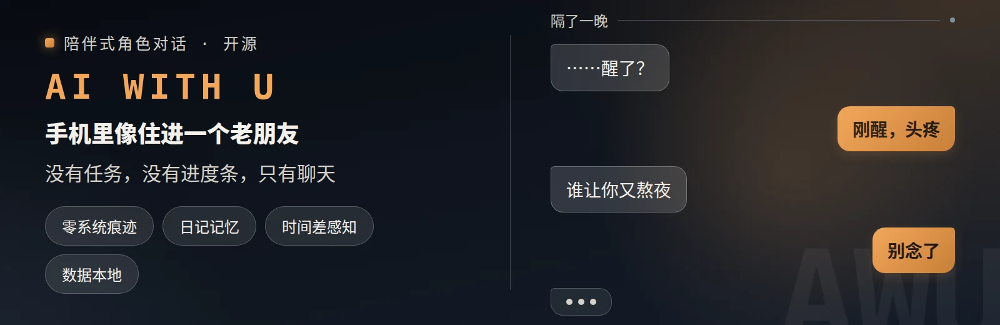

# AI-WITH-U

<p align="center">
  
</p>

> **AI-WITH-U v0.1.7** —— 开源。给你的 AI 装上角色扮演与长期记忆。
> 对话像老朋友发来的消息：没有任务，没有进度条，只有聊天。
> TA 会记得你说过的话，隔了一晚也知道你是刚睡醒。

🌐 **中文 | [English](README.en.md)**

[](LICENSE)
[](VERSION)

---

## ✨ 功能快速简介

**AI-WITH-U** 是给 AI 用的「陪伴式聊天 skill」——装上它，AI 就像真人用手机发消息一样陪你聊天，没有状态条、没有选项列表、没有 AI 腔，只有自然的对话。

**它能为你做什么？**

- 💬 **零系统痕迹**：每轮回复都是自然消息形态，像真人在发消息，不是客服在回答问题
- ⏰ **时间差感知**：TA 知道隔了一晚你是刚睡醒，隔了几天会说「这几天怎么样」
- 📔 **日记无感记忆**：值得记的事悄悄写进日记，对话里自然引用；发「看看日记」就能看到 TA 悄悄记了什么
- 🎭 **四种角色来源**：从喜欢的作品里请一位过来（蒸馏）、自己造一个、用角色卡、或导入本地卡
- 🔄 **新会话接续**：换个客户端也能续上你们的故事；「全新开始」随时重新来过
- 🔓 **开源 · 数据是你的**：MIT License，记忆就是本机 markdown——可编辑、可导出，换客户端也带着走

---

## 📌 当前版本动态（v0.1.7 · 你的身份与轻量关系）

> 本栏目介绍最新版本的变化；历史版本见 `references/changelog.md`。

**🪞 你的身份（新的）**
- 你可以是 TA 故事里的某个人：蒸馏时挑一位同作品里关系亲近的角色来演，或自己描述一句；**留空就是「你本人」**，不设也照常聊
- 四种建卡路径都接得住（蒸馏 / 自创 / 定制 / 导入），随时可用「改{名字}的你的身份」调整

**📖 故事背景（新的）**
- 每张卡多一层「故事背景」：他在什么处境里、外面正在发生什么、谁在追谁在帮；**你不是旁观者**，而是在故事里有位置的人
- 蒸馏卡会把原作的世界观与正在推进的局势一并带进来（世界观不再丢在卡外）

**🕊️ 关系轻量化**
- 亲密度收敛成「模型现读现算」的几个阶段：**非数值、不存盘**；只在选角色、角色簿和「关系」指令里以标签出现，**聊天里不出现**

**🎁 开箱即有三位**
- 自带 3 张预置角色卡，第一次加载自动就位；角色簿里已经有人的话，绝不打扰

**🔧 顺手把地基修平**
- 存储根口径统一（自定义存储目录后不再分裂数据）、开局判定三态、同夜/时区/到期日判定可执行化、蒸馏落库时机与断点续跑闭环

> 🕘 以下是 v0.1.6 / v0.1.5 带来的能力（继续有效）：

**💞 记得住，也提得起**
- 约定、生日与纪念日到期时，TA 会像真人一样自然提起（「考完了吗，应该不难吧」）——靠日记里的日子和事，不用你提醒
- 日记条目带上「在推进 / 事实 / 完结」的轻标记：翻旧账先想起还没了结的那些事；接续开场先读最近聊的，再翻相关的老账

**🗣️ 在意就说出口**
- 吃醋、嘴硬、主动找你都由人设自然流露：粘人的主动开口，傲娇的反着说，高冷的迂回表达——同一句话换个人设就是另一个味道

**🪶 先给你几句开场**
- 建好角色就备下 2-3 句不同风格的招呼（甜 / 傲娇 / 日常），想换口味说「换一句开场」就行

**📂 记忆是你的**
- 记忆就是本机 markdown：可导出、可备份、换客户端也带着走，详见下文「[记忆是你的](#记忆是你的)」

**🧹 更省力的两处**
- 蒸馏不再演一段「测试」给你看（那一步最出戏）：改成把五维覆盖、证据覆盖度、待定冲突列成清单请你确认，你点头就开聊；质量评分保持可选
- 重复条文收敛：确认语与动作格式各有唯一出处，要读的规则更短

**🛡️ 上版一并带来（v0.1.5，未单独发布）**
- 新增中英双语[免责声明](DISCLAIMER.md)（AI 生成内容 / 数据与隐私 / 无担保 等七章）；版权信息入 skill 元数据与文档落款
- 口径统一：轻量卡定义、重置判定、时间差优先级各在一处说清
- 内容尺度由你决定：不做审查、不设门控，亲密与 NSFW 剧情自然展开

**🧩 已有能力（v0.1.1–v0.1.4 延续）**
- 从作品里请 TA：报作品名 / 传文本文件 / 贴一段文字 / 给链接 / 联网补充
- 动作与台词分开：动作/神态用「（动作）」括号标出
- 角色簿：导入本地卡（PNG / CHARX）、删除角色、就地改日记
- 日记记忆：心情按条存储、「忘记{事}」按条删除、不确定的事宁可不记

**🧹 v0.1.1 回顾**：测试驱动修复 19 项（忘记定点清理 / 混合意图判定 / 时间差档位边界 等），详见 `references/changelog.md`

---

## 为什么需要它

和 AI 聊天，最常见的问题：

- ❌ 像在跟客服说话：「有什么可以帮您？」「很高兴为您服务」
- ❌ 每轮回复都是一大段 AI 腔，不像真人发消息
- ❌ 换个会话就失忆，每次都要重新自我介绍
- ❌ 角色千篇一律，说话没有自己的性格和声线
- ❌ 聊完就没了，上次说到哪、你提过什么都想不起来

**用了 AI-WITH-U 之后**：以上问题全部变成硬性纪律——零系统痕迹、时间差感知、日记记忆、角色声线，由 AI 每轮回复前强制自检，写出来的对话自带真人感。

---

## 安装（一条命令）

```bash
npx skills add Treasure-hub-agent/ai-with-u -g
```

`-g` 装到用户级 skills 目录（不加则装到当前目录的项目级目录，部分客户端重启后不加载）；安装过程会让你选客户端。支持 Hermes / Claude Code / Cursor（Windows / macOS / Linux），装完重启客户端，发「打开 AIWU」即可开局。

> **装好后自检**：确认 `~/.hermes/skills/ai-with-u/SKILL.md` 存在（Claude Code 对应 `~/.claude/skills/ai-with-u/`，Cursor 对应 `~/.cursor/skills/ai-with-u/`）。发「打开 AIWU」没反应时，先查这一步、再确认客户端已重启；仍不行改用手动复制。

> 没有 `npx skills`？见下方「手动复制」。

### 手动复制

把本仓库内容复制到对应客户端的 skills 目录：

| 客户端 | 目标目录 |
| --- | --- |
| Hermes | `~/.hermes/skills/ai-with-u/`（多 profile 配置：`~/.hermes/profiles/<profile>/skills/ai-with-u/`） |
| Claude Code | `~/.claude/skills/ai-with-u/` |
| Cursor | `~/.cursor/skills/ai-with-u/` |

复制完成后**重启客户端**，发「打开 AIWU」即可开局。

---

## 快速开始

1. 用你的客户端加载本 skill（`npx skills add` 或手动复制）
2. 发送「打开 AIWU」→ 进入选角界面
3. 选一位角色：从卡库选 / 自创 / 蒸馏 / 导入，四选一
4. 像给老朋友发消息一样开始聊天，TA 会用角色声线回你
5. 随时发「看看日记」看 TA 悄悄记了什么；发「使用指南」查看全量指令

> 提示：本 skill 开箱即用，无需任何额外配置，包内自带 3 张预置角色卡（首次加载自动就位，可直接开聊）；文件写权限缺失时自动降级为纯上下文模式，聊天不中断。

---

## 核心能力

| 能力 | 说明 |
| --- | --- |
| 💬 零系统痕迹 | 每轮回复都是自然消息形态，无状态条、无选项列表、无「已记录/已保存/已切换」式系统语 |
| 🎭 严守设定不设牢笼 | 角色卡决定性格、口癖、三观与关系基调，具体反应由情境自然生成，不机械复读设定 |
| ⏰ 时间差感知 | 感知真实时间与间隔，用语气档位自然表现「刚醒」「隔了一晚」，措辞由角色声线决定 |
| 📔 日记无感记忆 | 值得记的事静默写入日记，对话中自然引用，调取用「看看日记」，全程正文零痕迹 |
| 🔄 新会话接续 | 新会话可接续关系与记忆，支持「全新开始」重新来过 |
| 🎭 四种角色来源 | 选卡 / 自创 / 蒸馏 / 导入，统一落库到同一存储 |
| 🪞 你的身份（选填） | 让 TA 把你看作故事里的某个人（如同作品里的另一位角色），或由你自己描述；留空就是「你本人」 |
| 💫 交互模式切换 | 纯文本 / 文本+动作 随时切换，确认用角色口吻，立即回到对话 |
| 🛡️ 降级兜底 | 文件读写失败时静默降级为纯上下文模式，聊天不中断 |

---

## 记忆是你的

TA 的记忆就是 `~/.ai-with-u/` 下的几个 markdown / JSON 文件——不锁在某个平台里，也不放在谁的云上：

- 📂 **存本地，看得见**：角色卡、日记、会话记录都是纯文本，想读就读、想改就改
- 💾 **能导出、能备份**：整个目录复制走就是完整备份；换电脑、换客户端，接着往下聊
- 🔌 **换 agent 也带着走**：日记是普通 markdown，Hermes / Claude Code / Cursor 读的是同一份
- 🔒 **不上云、不注册**：没有账号、没有后台同步，聊天只发生在你的机器上
- ✂️ **忘不留都由你**：想让 TA 忘掉某件事就直说「忘记{事情}」，想彻底重来说「彻底重置」

记忆不在别人的服务器上，在你手里。

---

## 使用指南

这是一间只属于你和 TA 的小房间。
没有任务，没有进度条，只有聊天。

**这里能做什么**
- 💬 选一位角色，像给老朋友发消息一样聊天
- 🎨 新建属于你的角色，或从喜欢的作品里请一位过来
- 📔 TA 会记得你说过的话；隔了一晚，也知道你是刚睡醒
- 🔍 想看看 TA 悄悄记了什么？发「看看日记」

**可用指令**（英文别名对照见 [README.en.md](README.en.md) 的 Commands 表）
- 📔 看看日记 —— 打开 TA 的日记本
- 💬 切换纯文本 / 切换动作 —— 换一种聊天方式
- 🔄 继续 —— 续上上次的对话
- 💞 关系 —— 听 TA 说说你们现在多熟了（非数值）
- 🎴 角色卡 —— 查看 TA 的设定
- ✏️ 改{名字}的{字段} —— 微调 TA 的设定
- 🗑️ 忘记{事情} —— 让 TA 忘掉某件事
- ✏️ 改日记{内容} —— 就地改掉 TA 日记里的一条
- 🗑️ 删除{角色名} —— 把 TA 从角色簿里移除
- 🌱 全新开始 —— 重新开始这段对话（日记保留）
- ♻️ 彻底重置 —— 连日记一起清空，从头来过（不可撤销）
- 🪶 换一句开场 —— 从 TA 备着的几句里换下一句
- 🏠 回主菜单 —— 回到开始那个界面
- 🔄 继续蒸馏 —— 接着上次的蒸馏往下做
- 📖 使用指南 —— 再看一遍这里

聊得开心就好。

---

## 存储与权限

运行时数据存放在 `~/.ai-with-u/`（可用环境变量 `AIWU_STORAGE_ROOT` 覆盖路径），需要文件读写权限来保存角色卡、日记与会话记录；没有写权限时**静默降级**为纯上下文模式，聊天不中断。

---

## 架构

```
ai-with-u/
├── SKILL.md                      # P0 常驻核心（对话铁律 / 真人感 / 输入处理 / 记忆纪律 / 加载索引）
├── README.md                     # 本文件：使用指南 + 安装 + 架构
├── MANIFEST.json                 # 全文件 SHA256 清单（发布时生成）
├── package.json                  # npm 发布元数据
├── assets/                       # 视觉资产
│   ├── hero.webp                 # README 头图（网页用，约 40 KB）
│   └── hero.png                  # 头图源文件
├── VERSION                       # 版本号（0.1.7）
├── LICENSE                       # MIT License
├── DISCLAIMER.md                 # 免责声明（中文）
├── DISCLAIMER.en.md              # 免责声明（English）
├── .gitignore                    # 忽略运行时/临时产物
├── README.en.md                  # 英文版 README
├── CHANGELOG.md                  # 更新日志（详见 references/changelog.md）
├── CONTRIBUTING.md / SECURITY.md / CODE_OF_CONDUCT.md  # 贡献 / 安全 / 行为准则
├── .github/                      # Issue / PR 模板
├── .gitattributes                # LF 统一（text eol=lf）
├── presets/                      # 随包预置角色卡（首次加载幂等落位，可改名可删）
├── extended/                     # 按需加载模块
│   ├── character_card.md         # 角色卡格式 + 卡库管理 + 导入
│   ├── quick_create.md           # 自创：快速档 + 全面定制档
│   ├── distillation.md           # 蒸馏：从作品/文本提取角色
│   ├── diary_memory.md           # 日记机制：格式 / 无感读写 / 调取
│   ├── session_continuity.md     # 接续：单页选择 / 时间差 / 全新开始
│   └── run_config.md             # 交互模式 / 纯文本动作替代 / 降级
├── references/                   # 细则与指南
│   ├── human_chat_guide.md       # 真人感细则 + 禁止词库
│   ├── command_nav.md            # 指令字典
│   ├── changelog.md              # 更新日志
│   └── usage_guide.md            # 使用指南（= README 使用指南栏目）
└── schema/                       # JSON Schema（draft-07）
    ├── character_card.schema.json
    └── diary.schema.json
```

---

## 平台适配

| 能力 | 必需？ | 不支持时的表现 |
| --- | --- | --- |
| 文件读写 | ✅ 必需 | 静默降级为纯上下文模式（记忆不落盘，聊天不中断） |
| 多消息渲染（`\|\|` 分隔） | ⚠️ 可选 | 自动用空行分隔，禁止分隔符泄漏为可见字符 |
| 时间差感知 | ⚠️ 可选 | 按时段自然问候，不输出「检测到间隔」类系统语 |

---

## 常见问题

**Q: 和普通 prompt 聊天有什么区别？**
A: 普通 prompt 是「建议」，AI-WITH-U 是「硬规则 + 自检清单」：零系统痕迹、时间差感知、日记记忆都有强制自检步骤，AI 每轮回复前逐项核对。

**Q: 我的聊天数据会传到哪里？**
A: 角色卡、日记、会话记录都只存在你自己电脑的 `~/.ai-with-u/`（可配置 `AIWU_STORAGE_ROOT` 覆盖路径），不会上传。只有你在蒸馏时主动给链接、或明确确认后联网检索，才会发起一次读取。

**Q: 版本历史？**
A: 见 `references/changelog.md`，版本号以 `VERSION` 文件与 `SKILL.md` frontmatter 为准。

---

## 内容说明与版权

- **适用对象**：面向成年用户。
- **内容说明**：内容尺度由用户决定，不设限制——亲密与 NSFW 剧情同样自然展开，角色反应由人设与当前关系决定；skill 不内置审查、门控与拒绝模板。
- **AI 生成声明**：角色对话、日记与角色卡内容均由 AI 生成，角色为虚构，详见 [免责声明](DISCLAIMER.md)（English: [DISCLAIMER.en.md](DISCLAIMER.en.md)）。
- **版权**：MIT License（Copyright (c) 2026 Treasure-hub-agent），可自由使用、修改、分发。详见 [LICENSE](LICENSE)。
